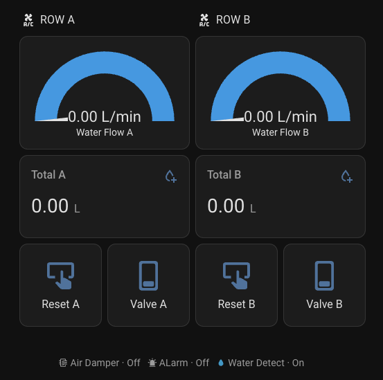
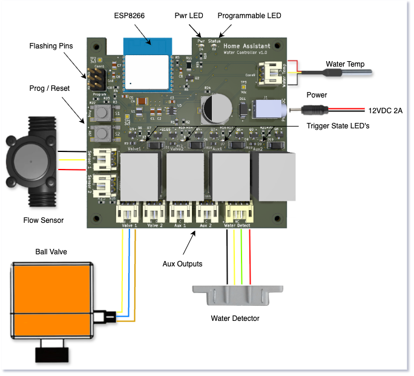

# Home Assistant Water Controller

This project adds water consumption, water detection and water valve shutoff using ESP-HOME and HOME ASSISTANT. It also has an input for a temperture probe and 2 auxiliary outputs you can use as NO and NC dry contacts.  Use it for hydroponics, water metering applications, pump and water valve control and smart water detection and control applications.

In this example* - Aux 1 and Aux 2 are being used for HVAC Control and Alarm Trigger.

\* *Example dashboard used in a private datacenter*

***Specifications:***

- *Power 12VDC 2A*
- *Reverse polarity protection*
- *2 - sensor inputs*
- *2 - valve controls*
- *2 - aux outputs*
- *1 - water temp sensor*
- *WiFi*

***You can use any suitable components as long as they are of similar specs***

**Flow Sensor:**  
<https://www.digiten.shop/products/digiten-g1-2-water-flow-hall-sensor-switch-flow-meter-1-30l-min>

**Ball Valve:  12VDC model**
<https://www.alibaba.com/product-detail/1-2-3-4-1-Motorized_1600518683132.html?spm=a2700.galleryofferlist.p_offer.d_image.2b8d13a0Jvvm2P&priceId=a2b6a3e8d2cb45f49c4f8311f7359036>

**Water Detection Sensor:** 
<https://www.grisk.com/wp-content/uploads/mdocs/Surface%20Mount%20Water%20Contact%20Sensor%202800%20Series.pdf>

**Water Temperature Sensor:**
<https://www.adafruit.com/product/381?srsltid=AfmBOopcvsphHhFMN7vdk5z4x4kFJ_ILU1R99YX9l1MTcdYD6azt7ZiW>

**BUILDING the BOARD:**

- Send the Gerber files to your favourite PCB maker.  
- Components required (included LCSC part numbers) [Open iBOM in Browser](https://marcellogentile.github.io/Home-Assistant-Water-Controller/ibom.html).

**FLASHING the BOARD:**

1. Connect the board to an ESP32 Programmer such as the ESP32-Prog using conn1.  Use Tx, Rx, Gnd connections.   You can also use IO0 and EN pins for auto upload if your programmer supports it. <https://docs.espressif.com/projects/esp-iot-solution/en/latest/hw-reference/ESP-Prog_guide.html>
2. MODIFY the configuration file to suit your needs (src/water-controller.yaml)
3. Flash using ESP-HOME Add-on
4. Create your dashboard
5. Enjoy

**TODO**
Configuration for the temperature sensor and led status.  A sample dashboard ready to use in Home Assistant.
